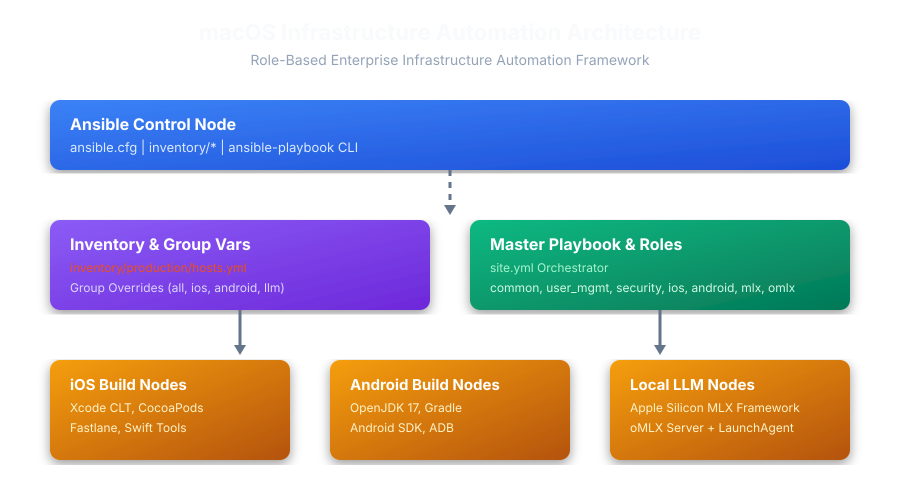
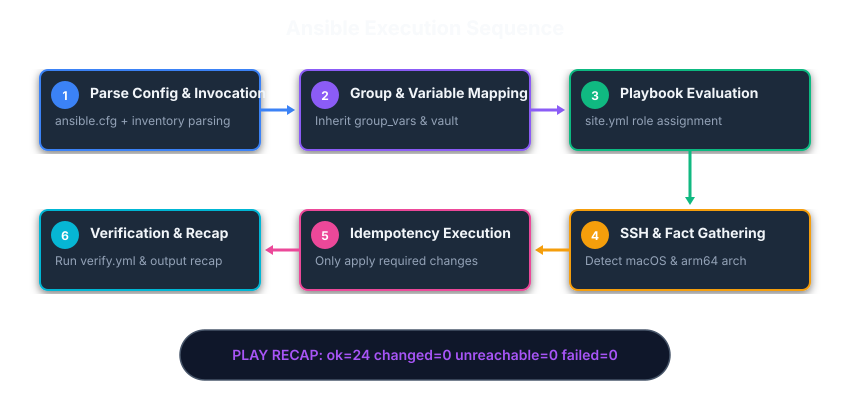
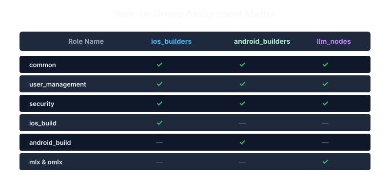

# Enterprise macOS Fleet Infrastructure Provisioning Framework

An enterprise-grade, modular, and fully idempotent Ansible automation repository designed to provision, harden, and manage a fleet of macOS computers (Mac Minis, Mac Studios, MacBooks, or VMs). This repository supports heterogeneous workloads including **iOS application builds**, **Android CI pipelines**, and **Local LLM Inference Engines (`mlx` & `omlx`)**.

---

##  Architecture Overview



---

##  Key Features & Design Principles

* **100% Parameterized & Non-Hardcoded**: Zero hardcoded usernames or fixed directory assumptions. Dynamically inherits system context or user-defined variables.
* **Role-Based Composition**: Decouples roles (`common`, `user_management`, `security`, `ios_build`, `android_build`, `mlx`, `omlx`) from host declarations. Assign capabilities via simple inventory groups.
* **macOS-Native Implementation**: Leverages OpenDirectory (`dscl`), `sysadminctl`, `scutil`, macOS Application Firewall (`socketfilterfw`), and user launch daemons (`LaunchAgents`).
* **Architecture-Aware**: Automatically switches Homebrew binary paths between Apple Silicon (`/opt/homebrew`) and Intel (`/usr/local`).
* **Deterministic Idempotency**: Running playbooks 1 time or 100 times yields zero unwanted state changes (`changed=0`).

---

##  Execution Workflow



---

## 📊 Role-to-Group Assignment Matrix



---

## 🛠️ Prerequisites & Setup

### 1. Control Machine Requirements
* macOS or Linux controller node with Python 3.9+ installed.
* Ansible 2.14+ installed via `pip`:
  ```bash
  pip install ansible
  ```
* No Ansible Galaxy collections or Galaxy roles are required at runtime.

### 2. Mac Target Node Preparation
Enable SSH Remote Login on target Mac computers:
* Open `System Settings -> General -> Sharing -> Remote Login` and toggle **ON**.
* Copy your SSH public key to the target Mac:
  ```bash
  ssh-copy-id -i ~/.ssh/id_ed25519.pub admin@<TARGET_MAC_IP>
  ```

### 3. Configure Inventory and Variables
* Update inventory host entries in `inventory/production/hosts.yml` (or use `inventory/development/hosts.yml` for local testing).
* Configure values in `inventory/*/group_vars/` including secrets in `vault.yml`.
* Validate SSH access before running playbooks:
  ```bash
  ssh admin@<TARGET_MAC_IP>
  ```

---

## 🚀 How to Run the Playbook (Different Execution Modes)

### Mode 1: Testing on a Single Mac (Development Mode)
If you have **ONE Mac** for testing, use the local development inventory (`inventory/development/hosts.yml`):

```bash
# 1. Syntax Verification
ansible-playbook -i inventory/development/hosts.yml site.yml --syntax-check

# 2. Dry Run / Check Mode (Simulates changes without modifying machine)
ansible-playbook -i inventory/development/hosts.yml site.yml --check --diff

# 3. Apply Full Provisioning
ansible-playbook -i inventory/development/hosts.yml site.yml

# 4. Confirm Idempotency (Should return changed=0)
ansible-playbook -i inventory/development/hosts.yml site.yml
```

---

### Mode 2: Provisioning Full Production Fleet
To provision the entire fleet across all target nodes:

```bash
# Execute across all nodes with 10 parallel SSH forks
ansible-playbook -i inventory/production/hosts.yml site.yml --forks 10
```

---

### Mode 3: Targeted Workload Execution (Using Tags)

Instead of running the full site playbook, execute specific workloads using Ansible tags:

```bash
# Run only Baseline System Prep & Homebrew
ansible-playbook -i inventory/production/hosts.yml site.yml --tags common

# Run only Security Baseline & Firewall Hardening
ansible-playbook -i inventory/production/hosts.yml site.yml --tags security

# Run only iOS Build Environment (Xcode CLI, CocoaPods, Fastlane)
ansible-playbook -i inventory/production/hosts.yml site.yml --tags ios

# Run only Android Build Pipeline (JDK 17, Android SDK, Gradle)
ansible-playbook -i inventory/production/hosts.yml site.yml --tags android

# Run only Apple Silicon Local LLM Infrastructure (MLX + oMLX)
ansible-playbook -i inventory/production/hosts.yml site.yml --tags llm
```

---

### Mode 4: Standalone Specialized Playbooks

You can also run domain-specific playbooks directly:

* **Bootstrap fresh machine**: `ansible-playbook -i inventory/production/hosts.yml bootstrap.yml`
* **Audit & Enforce Security**: `ansible-playbook -i inventory/production/hosts.yml security.yml`
* **Deploy iOS Builders**: `ansible-playbook -i inventory/production/hosts.yml ios.yml`
* **Deploy Android Builders**: `ansible-playbook -i inventory/production/hosts.yml android.yml`
* **Deploy LLM Inference Nodes**: `ansible-playbook -i inventory/production/hosts.yml llm.yml`

---

## ⚙️ Customizing Variables & User Accounts

### 1. Changing Target Automation User
To run under a specific user account on target Macs, pass the variable dynamically or edit `inventory/production/group_vars/all/main.yml`:

```bash
ansible-playbook -i inventory/production/hosts.yml site.yml -e "mac_automation_user=my_admin_user"
```

### 2. Dynamically Adding Users
Edit `inventory/production/group_vars/all/main.yml` to define extra user accounts:

```yaml
mac_additional_users:
  - username: "ci_builder"
    full_name: "CI Build Worker Account"
    admin: false
    shell: "/bin/zsh"
  - username: "ai_researcher"
    full_name: "AI Workload Account"
    admin: true
    shell: "/bin/zsh"
```

---

## 🔑 Managing Secrets with Ansible Vault

Secrets (API tokens, passwords) are isolated in `inventory/production/group_vars/all/vault.yml`.

### 1. Encrypting Secrets File
```bash
ansible-vault encrypt inventory/production/group_vars/all/vault.yml
```

### 2. Running Playbook with Vault Key
```bash
ansible-playbook -i inventory/production/hosts.yml site.yml --ask-vault-pass
```

---

## 🧩 Extending the Project (Adding New Roles)

Adding new roles is clean and modular:

1. **Create Role Directory Structure**:
   ```bash
   mkdir -p roles/monitoring/tasks roles/monitoring/defaults
   ```

2. **Define Tasks (`roles/monitoring/tasks/main.yml`)**:
   ```yaml
   - name: Check if node_exporter is installed
     ansible.builtin.command: "{{ homebrew_bin_path }}/brew list --formula node_exporter"
     register: node_exporter_check
     failed_when: false
     changed_when: false

   - name: Install node_exporter when missing
     ansible.builtin.command: "{{ homebrew_bin_path }}/brew install node_exporter"
     when: node_exporter_check.rc != 0
   ```

3. **Include in `site.yml`**:
   ```yaml
   - name: Provision Monitoring Infrastructure
     hosts: common_nodes
     roles:
       - role: monitoring
         tags: ["monitoring"]
   ```

---

## 🔍 Verification & Post-Check Tasks

Every role features an automated verification script (`tasks/verify.yml`). Upon execution completion, verification metrics are printed directly to stdout:

```text
TASK [mlx : Display MLX Framework Verification Summary] *******************************************************************
ok: [mac-mini-01] => {
    "msg": [
        "MLX Array Test Output: array([1, 2, 3], dtype=int32)",
        "MLX-LM Version: 0.21.1"
    ]
}
```

---

## ❓ Troubleshooting & FAQs

* **Issue: SSH Permission Denied**:
  Ensure Remote Login is enabled on the Mac (`System Settings -> Sharing -> Remote Login`) and your SSH public key is added to `~/.ssh/authorized_keys`.
* **Issue: Homebrew Command Not Found**:
  Verify your shell profile loads Homebrew path (`eval $(/opt/homebrew/bin/brew shellenv)`). The `common` role configures this automatically.
* **Issue: Xcode License Prompt Blocking CI**:
  Run `sudo xcodebuild -license accept` or ensure `ios_xcode_clt_auto_accept_license: true` is enabled in `group_vars`.
